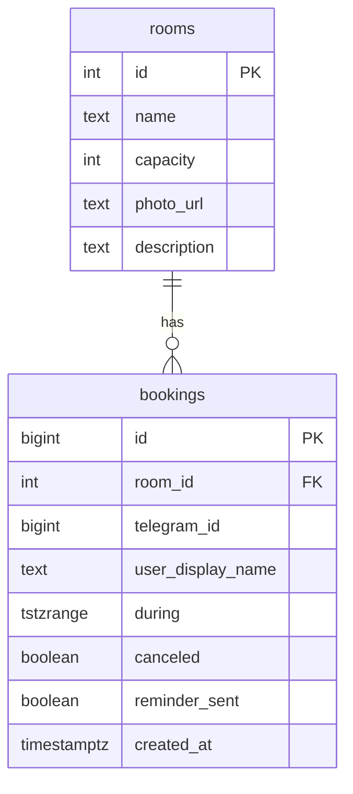

# Meeting Room Booking

Telegram Mini App + FastAPI + PostgreSQL + aiogram 3 для бронирования переговорных.

> Скриншот/GIF Mini App: добавьте в `docs/screenshot.png` после первого прогона в Telegram.

## Возможности

- Список комнат и занятость на день (публичные слоты без PII)
- Бронирование 15 мин – 4 часа с защитой от гонок (PostgreSQL `EXCLUDE`)
- Выбор конкретного времени внутри свободного интервала: начало с шагом 30 мин + длительность
- Жёсткие рабочие часы 09:00–18:00 МСК как граница бронирования и слотов
- Telegram Mini App с тёмным UI и flip-индикатором занятости
- Бот: `/start`, `/book` — бронирование на естественном языке через Groq (`openai/gpt-oss-120b`), результат парсинга открывает Mini App на экране подтверждения с предзаполненным временем — пользователь всегда видит и может поправить перед реальным бронированием; `/mybookings` (отмена), `/help`, напоминания за N минут
- HMAC-валидация `initData` на каждый запрос к `/api/bookings*`

## Быстрый старт

Требования: Docker Desktop / Compose v2.

```bash
cp .env.example .env
# заполните BOT_TOKEN (можно временный для healthcheck), WEBHOOK_SECRET
docker compose up --build
```

Откройте http://localhost:8001/health — должно быть `{"status":"ok"}` (хост-порт `8001`, контейнер слушает `8000`).

Mini App раздаётся с того же origin (`/`). Для Telegram нужен HTTPS `WEBAPP_URL` (туннель или домен Railway/Render). Локально в браузере: `DEBUG=true` и `VITE_DEBUG_TELEGRAM_ID=42` при `npm run dev` во `frontend/`.

## Модель данных



Частичный `EXCLUDE USING gist (room_id WITH =, during WITH &&) WHERE (NOT canceled)` гарантирует отсутствие пересечений активных броней на уровне БД.

Правила бронирования (office hours, timezone, шаг сетки, max duration) отдаются с бэкенда через `GET /api/config` — фронт их только отображает, без хардкода.

## Почему так

| Решение | Зачем |
|--------|--------|
| `EXCLUDE` + `btree_gist` | Гонки на один слот закрываются в Postgres, а не «optimistic check» в Python |
| `tstzrange` UTC `[start, end)` | Одна ось времени, полуоткрытый интервал без споров на границе |
| HMAC `initData` + `auth_date` ≤ 5 мин | `telegram_id` нельзя подделать из body; replay ограничен |
| Same-origin StaticFiles | Mini App и API без CORS и без утечки bot token во frontend-бандл |
| Слоты без имени/telegram_id | Публичное расписание не раскрывает, кто сидел в комнате |
| LLM только парсит intent, не создаёт бронь напрямую | Модель может ошибиться на неоднозначном тексте; результат проходит через тот же pick/confirm экран и бизнес-валидацию, что и ручной ввод |

## Аудит перед сдачей

Самостоятельный security и code-quality аудит перед сдачей (`review-security` + `sql-optimizer`). Устранено:

- misconfiguration debug-auth в `.env.example` (`DEBUG=false`, пустой `WEBHOOK_SECRET` вместо плейсхолдера)
- partial-индексы GiST не матчились из-за `IS false` вместо `NOT canceled` (подтверждено `EXPLAIN ANALYZE`)
- rate limit на `POST /telegram/webhook`
- `redact_secrets` расширен на `DATABASE_URL` / webhook secret
- удалён мёртвый код (неиспользуемые методы, схемы, зависимости)

Изначально для `/book` пробовали Gemini Flash, но provisioning API-ключа упёрся в новое требование Google Cloud (обязательная 2FA + нестабильный доступ к созданию проекта на момент тестирования) — переключились на Groq (`openai/gpt-oss-120b`); интерфейс сервиса абстрагирован, смена заняла менее часа.

## Переменные окружения

См. [.env.example](.env.example). Секреты (`BOT_TOKEN`, `WEBHOOK_SECRET`, `DATABASE_URL`) только в `.env` / секретах платформы — не в git и не во frontend.

Опционально: `GROQ_API_KEY` — без него `/book` отвечает «LLM-бронирование недоступно», остальной функционал не затронут. Ключ бесплатно без карты: [console.groq.com/keys](https://console.groq.com/keys).

## Деплой (Railway / Render + Neon)

1. Создайте БД на Neon, скопируйте async URL (`postgresql+asyncpg://...`).
2. Задеплойте этот репозиторий на Railway/Render (Dockerfile уже multi-stage).
3. Задайте env: `DATABASE_URL`, `BOT_TOKEN`, `WEBAPP_URL` (= HTTPS URL сервиса), `PUBLIC_BASE_URL` (тот же origin), `WEBHOOK_SECRET`, `DEBUG=false`, опционально `GROQ_API_KEY`.
4. После деплоя бот вызовет `setWebhook` на `{PUBLIC_BASE_URL}{WEBHOOK_PATH}` с `secret_token`.

Postgres в compose наружу не публикуется (`expose`, не `ports`) — в проде Neon и так вне compose.

## Тесты

```bash
# поднять стек, затем:
docker compose exec app pytest -q
docker compose exec app python scripts/race_condition_test.py
# с хоста (порт 8001):
# $env:BASE_URL="http://127.0.0.1:8001"; python scripts/race_condition_test.py
```

Скрипт гонки: N параллельных POST на один слот → ровно один `201`, остальные `409`.

## Структура

```
backend/   FastAPI, модели, alembic, static Mini App
bot/       aiogram handlers + webhook
frontend/  Vite + React + Tailwind v4
scripts/   entrypoint, race_condition_test.py
```
