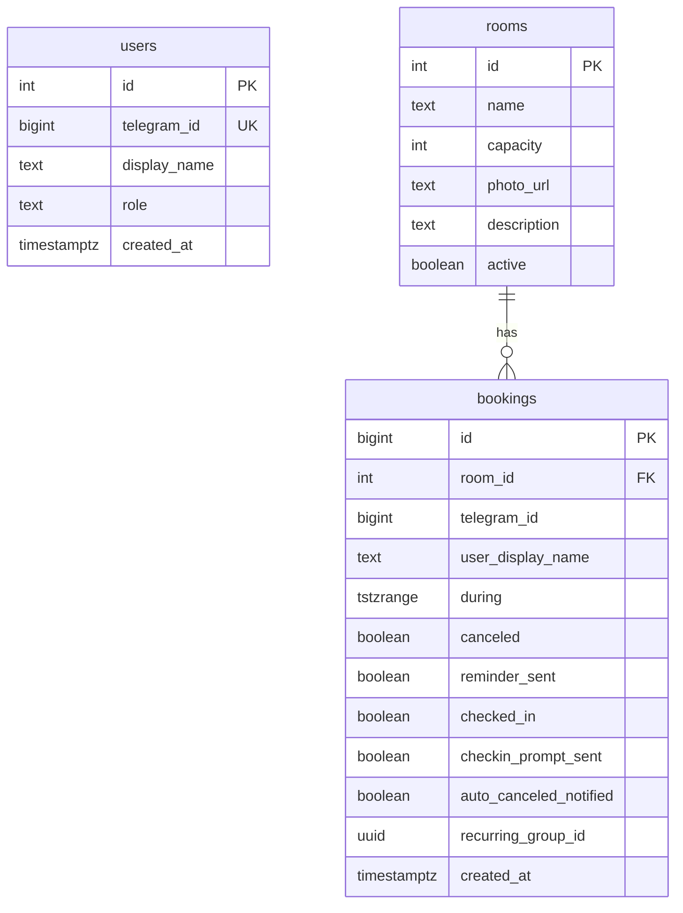

# Meeting Room Booking

Telegram Mini App + FastAPI + PostgreSQL + aiogram 3 для бронирования переговорных.

> Скриншот/GIF Mini App: добавьте в `docs/screenshot.png` после первого прогона в Telegram.

## Возможности

- Whitelist-доступ (таблица `users`) + роль admin; приглашение коллег через `/invite`
- Список комнат и занятость на день (публичные слоты без PII); админ управляет комнатами через `/admin`
- Бронирование 15 мин – 4 часа с защитой от гонок (PostgreSQL `EXCLUDE`)
- Повтор еженедельно (2–8 недель) с пропуском занятых слотов и отменой всей серии
- No-show: подтверждение присутствия в начале брони, автоотмена без check-in
- Выбор конкретного времени внутри свободного интервала: начало с шагом 30 мин + длительность
- Жёсткие рабочие часы 09:00–18:00 МСК как граница бронирования и слотов
- Telegram Mini App с тёмным UI и flip-индикатором занятости
- Бот: `/start`, `/book` (NL через Groq), `/mybookings`, `/invite`, `/admin`, `/help`, напоминания
- HMAC-валидация `initData` на каждый запрос к `/api/bookings*`
- `/health` с проверкой БД; опционально Sentry

## Быстрый старт (локально)

Требования: Docker Desktop / Compose v2.

```bash
cp .env.example .env
# заполните BOT_TOKEN, WEBHOOK_SECRET, BOOTSTRAP_ADMIN_TELEGRAM_ID (ваш Telegram id)
docker compose up --build
```

Откройте http://localhost:8001/health — должно быть `{"status":"ok","db":"ok"}` (хост-порт `8001`, контейнер слушает `8000`).

Mini App раздаётся с того же origin (`/`). Для Telegram в проде нужен постоянный HTTPS (`WEBAPP_URL` на Railway). Для локальной отладки без деплоя можно временно поднять туннель (cloudflared / ngrok) и прописать его в `WEBAPP_URL` + `PUBLIC_BASE_URL` — это опция разработки, не прод.

Локально в браузере: `DEBUG=true` и `VITE_DEBUG_TELEGRAM_ID=<whitelist id>` при `npm run dev` во `frontend/`.

## Приглашение пользователей (whitelist)

Доступ не выдаётся автоматически на `/start`.

1. Коллега пишет `/start` боту [@userinfobot](https://t.me/userinfobot) (или аналогу) и присылает вам свой числовой `Id`.
2. Админ в боте бронирования: `/invite <telegram_id>`.
3. После этого коллега может `/start` и бронировать.

Первый админ создаётся при старте приложения, если таблица `users` пуста и задан `BOOTSTRAP_ADMIN_TELEGRAM_ID`.

## Модель данных



Частичный `EXCLUDE USING gist (room_id WITH =, during WITH &&) WHERE (NOT canceled)` гарантирует отсутствие пересечений активных броней на уровне БД.

Правила бронирования (office hours, timezone, шаг сетки, max duration, max recurring weeks) отдаются через `GET /api/config`.

## Почему так

| Решение | Зачем |
|--------|--------|
| `EXCLUDE` + `btree_gist` | Гонки на один слот закрываются в Postgres |
| Whitelist `users` | Офисный бот не должен быть открыт всему Telegram |
| `rooms.active` soft-delete | История броней и FK остаются валидными |
| No-show check-in | Освобождает комнату, если человек не пришёл |
| `recurring_group_id` | Отмена серии без «батча без проверки» конфликтов |
| HMAC `initData` + `auth_date` ≤ 5 мин | `telegram_id` нельзя подделать из body |
| Same-origin StaticFiles | Mini App и API без CORS |
| LLM только парсит intent | Подтверждение всегда через pick/confirm |

## Деплой на Railway (постоянный домен)

Делается в UI Railway (не кодом):

1. [railway.app](https://railway.app) → **New Project** → **Deploy from GitHub repo** → выбрать репозиторий бота.
2. **Add Postgres** plugin **или** (рекомендуется) внешний [Neon](https://neon.tech) — постоянный free tier без риска usage-billing Railway на БД. В `DATABASE_URL` используйте async-строку `postgresql+asyncpg://...`.
3. **Variables** — скопируйте ключи из [.env.example](.env.example) с реальными значениями: `DATABASE_URL`, `BOT_TOKEN`, `WEBHOOK_SECRET`, `BOOTSTRAP_ADMIN_TELEGRAM_ID`, опционально `GROQ_API_KEY`, `SENTRY_DSN`. `DEBUG=false`.
4. Railway выдаст постоянный HTTPS-домен вида `*.up.railway.app` — задайте его в `WEBAPP_URL` и `PUBLIC_BASE_URL`.
5. Redeploy → проверьте `/health` → webhook зарегистрируется автоматически при старте (`setWebhook` на `{PUBLIC_BASE_URL}{WEBHOOK_PATH}`).

После этого cloudflared-туннель для постоянной работы не нужен.

## Мониторинг в проде

- Зарегистрируйте бесплатный [UptimeRobot](https://uptimerobot.com) HTTP(s) monitor на `{WEBAPP_URL}/health` с интервалом 5 минут. Ответ `{"status":"ok","db":"ok"}` и код 200; при недоступной БД — `503` и `"db":"error"`.
- Опционально: [Sentry](https://sentry.io) free tier — задайте `SENTRY_DSN`; без него SDK не инициализируется.

## Переменные окружения

См. [.env.example](.env.example). Секреты (`BOT_TOKEN`, `WEBHOOK_SECRET`, `DATABASE_URL`, `SENTRY_DSN`) только в `.env` / секретах платформы.

Опционально: `GROQ_API_KEY` — без него `/book` отвечает «LLM-бронирование недоступно».  
Опционально: `SENTRY_DSN`.  
`NO_SHOW_ENABLED=false` отключает check-in / автоотмену (например, для очень коротких броней в тестах).

## Тесты

```bash
docker compose exec app pytest -q
docker compose exec app python scripts/race_condition_test.py
```

## Структура

```
backend/   FastAPI, модели, alembic, static Mini App
bot/       aiogram handlers + webhook + /admin FSM
frontend/  Vite + React + Tailwind v4
scripts/   entrypoint, race_condition_test.py
```
